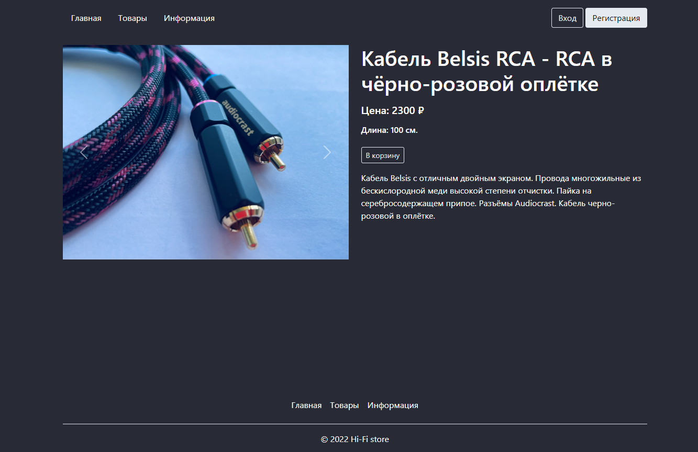

<h1 align="center">Hi-Fi Store</h1>

[](https://www.python.org/)
[](https://www.djangoproject.com/)
[](https://getbootstrap.com/)


## Оглавление

1. [Описание проекта](#описание-проекта)
2. [Посетить сайт](#посетить-сайт)
3. [Использовованный стэк](#использованный-стэк)
4. [Запуск на локальной машине](#запуск-проекта-на-локальной-машине)
5. [Внешний вид](#внешний-вид)

## Описание проекта

В данном проекте реализован интернет магазин аудио-кабелей высокого качества,
изготавливаемых и продаваемых мной на протяжении последнего года.

Основные возможности сайта:
 - Регистрация / авторизация пользователей
 - Фильтрация товаров по типу
 - Пополнение корзины, оформление заказа
 - Выбор способа получения заказа
 - Личный кабинет с историей заказов
 - Подробная информация об оформленных заказах

## Посетить сайт

Сайт находится в рабочем состоянии 24/7, на данный момент, в качестве демонстрации, на 
VPS. 

[Посетить сайт](http://193.3.23.151:8000)

Поскольку для оформления заказа необходимо быть зарегистрированным пользователем, 
для проверки функционала сайта можно использовать следующие данные:

Email: `testuser@gmail.com`<br>
Пароль: `Test_password`

## Использованный стэк
Использовались наиболее актуальные на момент разработки версии. 

Проект написан на языке ***Python*** с помощью фреймворка ***Django***. 
Стилизация сайта, за некоторым исключением, реализована при помощи ***Bootstrap***.
Кроме того имеется несколько простых скриптов на ***JavaScript***

Также использованы вспомогательные пакеты, такие как `isort` для сортировки импортов,
`python-dotenv` для сохранения паролей в переменные окружения, 
`django-debug-toolbar` для отладки ORM и др.

Все необходимые зависимости описаны в файле `requirements.py`

## Запуск проекта на локальной машине
 - Склонировать репозиторий
```
$ git clone https://github.com/BreachAndHole/audio-store-django.git
$ cd audio-store-django/
```
 - Установить и активировать виртуальное окружение
```
$ python3.10 -m venv venv
$ source venv/bin/activate
```
 - Установить необходимы библиотеки
```
$ pip install -r requirements.txt
```
 - Настроить базу данных (PostgreSQL)
   - В файле `cables_shop/settings.py` внести необходимые значения в список`DATABASES`:
     - `NAME` - название вашей БД
     - `USER` - имя пользователя базы, подключающегося к БД
     - `PORT` - порт для подключения к БД
   - Создать фал с названием `.env`
   - В созданном файле прописать следующие строки:
     - `SECRET_KEY=` - секретный ключ django
     - `DATABASE_PASSWORD=` - пароль для подключения пользователя к БД
     - `DATABASE_HOST=` - IP адрес, по которому расположена ваша база данных

При желании можно заменить базу данных на другую. 
В этом случае необходимо внести соответствующие изменения в список `DATABASES` 

 - Запустить локальный сервер
```
$ python3.10 cables_shop/manage.py runserver
```

## Внешний вид

 - Главная страница


___

 - Страница регистрации пользователя


___

 - Личный кабинет пользователя


___


 - Информация о заказе


___


 - Страница представленных товаров


___


 - Страница товара


___


 - Страница оформления заказа

